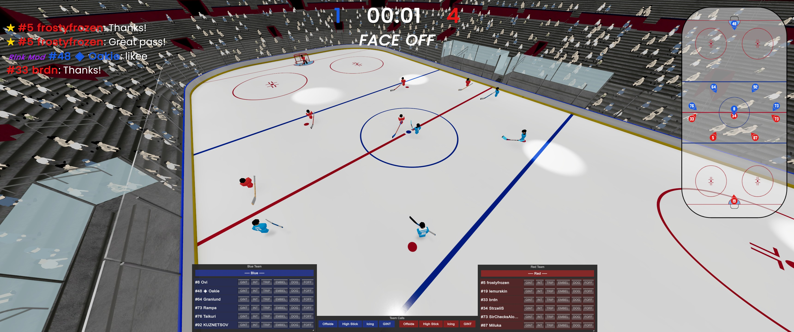

# Ref Client

This client side mod renders a clickable UI for referees using the [Ruleset mod](https://github.com/oomtm450/Ruleset_PuckMod) by [oomtm450](https://github.com/oomtm450).  
The UI is toggled with `Shift+H`. During this mode, you can right click to use the mouse cursor freely.

## Development

See the [Puck modding GitBook](https://puck.gitbook.io/modding) for information on how to set up a local environment. See the [local.targets.example](local.targets.example) file for instructions on how to set up auto-copy of the resulting DLL.

## License

[MIT](https://choosealicense.com/licenses/mit/)
